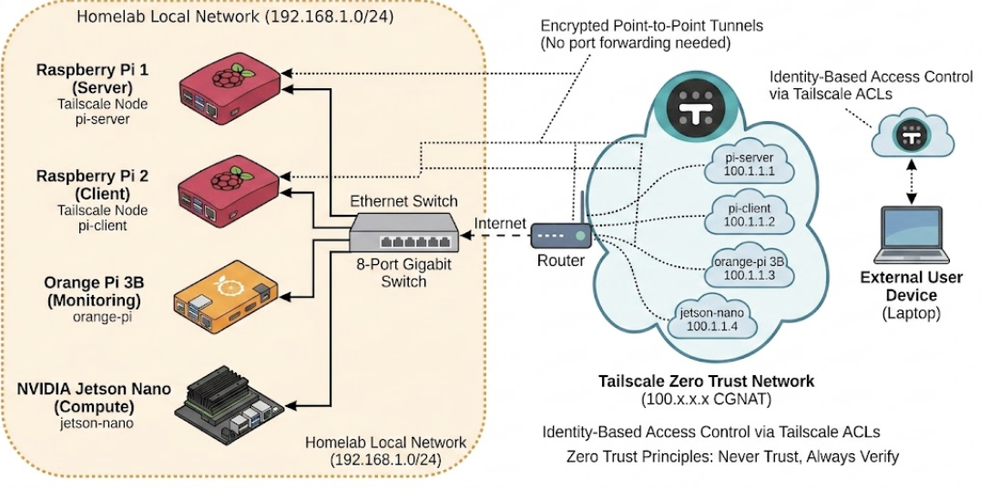

<!-- PROJECT SHIELDS -->
<a name="readme-top"></a>

[![Contributors][contributors-shield]][contributors-url]
[![Forks][forks-shield]][forks-url]
[![Stargazers][stars-shield]][stars-url]
[![Issues][issues-shield]][issues-url]
[![License][license-shield]][license-url]
[![LinkedIn][linkedin-shield]][linkedin-url]
[](https://www.buymeacoffee.com/wanghley)

<!-- PROJECT LOGO -->
<br />
<div align="center">
  <a href="https://github.com/Wanghley/edge-trust-offload">
    
  </a>

  <h3 align="center">EdgeTrust-Offload</h3>

  <p align="center">
    Quantifying the latency cost of Zero-Trust security in edge AI task offloading.<br/>
    Real hardware · Real ZTA enforcement · Real measurements.
    <br />
    <a href="docs/report/main.pdf"><strong>Read the paper »</strong></a>
    &nbsp;·&nbsp;
    <a href="https://github.com/Wanghley/edge-trust-offload/issues">Report Bug</a>
    &nbsp;·&nbsp;
    <a href="https://github.com/Wanghley/edge-trust-offload/issues">Request Feature</a>
  </p>
</div>

---

<!-- TABLE OF CONTENTS -->
<details>
  <summary>Table of Contents</summary>
  <ol>
    <li><a href="#about-the-project">About The Project</a></li>
    <li><a href="#built-with">Built With</a></li>
    <li><a href="#hardware-requirements">Hardware Requirements</a></li>
    <li><a href="#getting-started">Getting Started</a>
      <ul>
        <li><a href="#1-clone-the-repository">1 · Clone the Repository</a></li>
        <li><a href="#2-set-up-tailscale-zero-trust-overlay">2 · Set Up Tailscale</a></li>
        <li><a href="#3-jetson-orin-nano-edge-server">3 · Jetson Orin Nano (server)</a></li>
        <li><a href="#4-raspberry-pi-3b-client">4 · Raspberry Pi 3B (client)</a></li>
      </ul>
    </li>
    <li><a href="#running-the-experiments">Running the Experiments</a></li>
    <li><a href="#analyzing-results">Analyzing Results</a></li>
    <li><a href="#project-structure">Project Structure</a></li>
    <li><a href="#roadmap">Roadmap</a></li>
    <li><a href="#contributing">Contributing</a></li>
    <li><a href="#license">License</a></li>
    <li><a href="#citation">Citation</a></li>
    <li><a href="#contact">Contact</a></li>
    <li><a href="#acknowledgments">Acknowledgments</a></li>
  </ol>
</details>

---

<!-- ABOUT THE PROJECT -->
## About The Project

**EdgeTrust-Offload** is a real-world measurement study that quantifies the latency trade-off between local execution and secure edge offloading when a **Zero-Trust Architecture (ZTA)** is enforced end-to-end.

Most edge-offloading frameworks assume a trusted network. In healthcare, robotics, and industrial IoT, that assumption doesn't hold — every hop must be authenticated and encrypted. EdgeTrust-Offload answers the question:

> *When does secure offloading under ZTA become **slower** than just running the task locally?*

We pair a **Raspberry Pi 3B** sensing node with an **NVIDIA Jetson Orin Nano** edge server, enforce Zero-Trust via Tailscale/WireGuard (ChaCha20-Poly1305), and benchmark an 8-channel EMG gesture-recognition pipeline across four scenarios — local execution, insecure LAN offload, full ZTA offload, and ZTA under three congestion levels.

**Key findings from n = 100 trials per cell:**
| Finding | Value |
|---|---|
| Local execution — normal complexity | 19.7 ± 6.9 ms |
| Local execution — high complexity (thermal throttle) | 132 ± 50 ms, p95 = **204 ms** |
| Insecure LAN offload | 80.7 ± 5.8 ms (serialization bottleneck) |
| ZTA offload (Tailscale/WireGuard) | 111 ± 6.6 ms |
| ZTA overhead vs insecure LAN | **+30 ms** (23 ms crypto + 7 ms Tailscale) |
| Congestion sensitivity (up to 60 ms / 20 ms / 5% loss) | **< 1.4 ms** mean delta |
| ZTA offload p95 — high complexity | **119 ms** vs 204 ms local → 1.7× tail improvement |

<p align="right">(<a href="#readme-top">back to top</a>)</p>

---

### Built With

[![Python][python-shield]][python-url]
[![FastAPI][fastapi-shield]][fastapi-url]
[![NVIDIA CUDA][cuda-shield]][cuda-url]
[![TensorRT][trt-shield]][trt-url]
[![Tailscale][tailscale-shield]][tailscale-url]
[![Raspberry Pi][rpi-shield]][rpi-url]
[![NumPy][numpy-shield]][numpy-url]

<p align="right">(<a href="#readme-top">back to top</a>)</p>

---

<!-- HARDWARE REQUIREMENTS -->
## Hardware Requirements

| Role | Hardware | Key Specs |
|---|---|---|
| **Client (sensing node)** | Raspberry Pi 3B | ARM Cortex-A53 @ 1.2 GHz, 1 GB LPDDR2 |
| **Edge server (compute node)** | NVIDIA Jetson Orin Nano | 1024 Ampere CUDA cores, 8 GB LPDDR5, JetPack 6.1 |
| **Network** | Gigabit Ethernet switch | Physical RTT < 0.5 ms |
| **ZTA overlay** | Tailscale (WireGuard) | Free tier covers 2-node mesh |
| *(optional)* **Auxiliary** | Orange Pi 3B | congestion injection via `tc netem` |

> The system also runs in simulation mode — useful for development on any Linux machine without the physical hardware.

<p align="right">(<a href="#readme-top">back to top</a>)</p>

---

<!-- GETTING STARTED -->
## Getting Started

### 1 · Clone the Repository

Clone onto **both** devices (or a development machine):

```sh
git clone https://github.com/Wanghley/edge-trust-offload.git
cd edge-trust-offload
```

---

### 2 · Set Up Tailscale (Zero-Trust Overlay)

Install Tailscale on **both** the Raspberry Pi and the Jetson:

```sh
curl -fsSL https://tailscale.com/install.sh | sh
sudo tailscale up
```

Note each device's Tailscale IP (`100.x.x.x`):

```sh
tailscale ip -4      # run on each device
```

You will use these IPs in the experiment runner:
- **Client (RPi 3B):** e.g. `100.114.225.52`
- **Server (Jetson):** e.g. `100.85.193.50`

> The Jetson server **rejects** any request not originating from a `100.x.x.x` Tailscale address when running in secure mode.

---

### 3 · Jetson Orin Nano — Edge Server

#### 3.1 Install Python dependencies

```sh
cd edge-trust-offload
pip install fastapi uvicorn[standard] numpy onnxruntime psutil python-dotenv requests
```

> **TensorRT** is already installed with JetPack. No separate install needed.
> Do **not** try to install `onnxruntime-gpu` from PyPI on Jetson — use the CPU wheel; TRT is the GPU backend.

#### 3.2 Build the TensorRT inference engine

```sh
# Build the lightweight local model (used as reference)
python scripts/build_lite_model.py

# Build the heavier server-side model
python scripts/build_heavy_model.py
```

Verify the ONNX export is valid (should be ≥ 1 MB):

```sh
ls -lh models/gesture_cnn_heavy.onnx
```

#### 3.3 Configure allowed devices

Create a `.env` file at the repo root on the Jetson:

```sh
cat > .env <<EOF
# Comma-separated list of device-id:tailscale-ip pairs
ALLOWED_DEVICES=rpi-client-benchmark:100.114.225.52

# Set to 1 to disable ZTA checks (S2 insecure baseline only)
INSECURE_MODE=0

# Bind address — keep 0.0.0.0 to accept from all interfaces
TAILSCALE_IP=0.0.0.0
PORT=8000
EOF
```

#### 3.4 Start the server (secure ZTA mode)

```sh
# Secure mode (S3 / S4 experiments)
uvicorn server.compute_server:app --host 0.0.0.0 --port 8000

# Or use the startup script
bash server/startup.sh
```

For the insecure baseline (S2), restart with:

```sh
INSECURE_MODE=1 uvicorn server.compute_server:app --host 0.0.0.0 --port 8000
```

#### 3.5 Verify the server is reachable

From the **Jetson itself**:
```sh
curl http://localhost:8000/health
```

From the **RPi** (Tailscale path):
```sh
curl http://100.85.193.50:8000/health
```

Expected response:
```json
{
  "status": "ok",
  "inference_backend": "tensorrt",
  "system_stats": { "gpu_temp_c": 42.0, "ram_used_mb": 1240 }
}
```

---

### 4 · Raspberry Pi 3B — Client

#### 4.1 Install Python dependencies

```sh
cd edge-trust-offload

# Use piwheels for ARM-optimized wheels
pip install -r requirements_rpi.txt \
    --extra-index-url https://www.piwheels.org/simple
```

> **Python 3.13:** `tflite-runtime` has no wheel for Python 3.13+. The scheduler automatically falls back to `ai-edge-litert` or `onnxruntime`. No action needed — the experiment runner uses pure NumPy.

#### 4.2 Start the sensor emulator

The sensor emulator serves synthetic BHaM-distribution EMG windows over HTTP:

```sh
python client/sensor_emulator.py --port 9000
```

Verify it is running:
```sh
curl http://localhost:9000/get_window | python -m json.tool | head -10
```

#### 4.3 (Optional) Test the Jetson connection

```sh
python -m client.main_scheduler \
    --jetson-ip 100.85.193.50 \
    --jetson-port 8000 \
    --test-connection
```

#### 4.4 Run the live adaptive scheduler

```sh
python -m client.main_scheduler \
    --jetson-ip 100.85.193.50 \
    --jetson-port 8000 \
    --emulator-url http://localhost:9000/get_window \
    --device-id rpi-client-benchmark \
    --alpha 1.0 --beta 1.0 --gamma 1.0 --delta 1.0 \
    --verbose
```

The scheduler logs its per-window decisions to `offload_telemetry.csv`.

<p align="right">(<a href="#readme-top">back to top</a>)</p>

---

<!-- RUNNING THE EXPERIMENTS -->
## Running the Experiments

All benchmark experiments are driven by `experiments/run_experiments.py`. It executes all four scenarios automatically and writes structured JSONL results.

### Scenario overview

| ID | Description | Network path | ZTA enforced |
|---|---|---|---|
| **S1** | Local execution on RPi | None | — |
| **S2** | Insecure LAN offload | `192.168.0.x` (eth0 direct) | ❌ |
| **S3** | Secure ZTA offload | Tailscale `100.x.x.x` | ✅ |
| **S4-Light** | ZTA + light congestion | Tailscale + tc netem | ✅ |
| **S4-Medium** | ZTA + medium congestion | Tailscale + tc netem | ✅ |
| **S4-Heavy** | ZTA + heavy congestion | Tailscale + tc netem | ✅ |

### Step-by-step

#### Step 1 — Start the server (Jetson)

Run the server in **insecure mode first** so both S2 and S3 can share one server process:

```sh
# On Jetson — accepts both LAN (S2) and Tailscale (S3/S4) connections
INSECURE_MODE=1 ALLOWED_DEVICES="rpi-client-benchmark:100.114.225.52" \
    uvicorn server.compute_server:app --host 0.0.0.0 --port 8000
```

#### Step 2 — Start the sensor emulator (RPi)

```sh
# On RPi
python client/sensor_emulator.py --port 9000 &
```

#### Step 3 — Run all scenarios (RPi)

```sh
# On RPi
python experiments/run_experiments.py \
    --jetson-ip   100.85.193.50 \
    --insecure-ip 192.168.0.6   \
    --jetson-port 8000           \
    --emulator-url http://localhost:9000/get_window \
    --device-id rpi-client-benchmark \
    --n-trials 100               \
    --output-dir results/experiment_$(date +%Y%m%d_%H%M%S)
```

This runs **S1 → S2 → S3 → S4-light → S4-mid → S4-heavy** sequentially, injecting and clearing congestion automatically between S4 runs.

> **Congestion injection** uses `sudo tc qdisc` on the Jetson's `tailscale0` interface. The experiment runner handles this over SSH — make sure passwordless `sudo` is configured for `tc` on the Jetson, or run the congestion commands manually (see below).

#### Manual congestion injection (if needed)

Run these **on the Jetson** before each S4 trial batch:

```sh
# Light  (10 ms / 3 ms jitter / 0.5% loss)
sudo tc qdisc replace dev tailscale0 root netem delay 10ms 3ms loss 0.5%

# Medium (25 ms / 8 ms jitter / 2% loss)
sudo tc qdisc replace dev tailscale0 root netem delay 25ms 8ms loss 2%

# Heavy  (60 ms / 20 ms jitter / 5% loss)
sudo tc qdisc replace dev tailscale0 root netem delay 60ms 20ms loss 5%

# Clear congestion after each run
sudo tc qdisc del dev tailscale0 root
```

Verify congestion is active:
```sh
tc qdisc show dev tailscale0
```

#### Running scenarios individually

```sh
# S1 only — local execution
python experiments/run_experiments.py --scenarios S1 --n-trials 100 \
    --output-dir results/s1_only

# S3 only — ZTA offload
python experiments/run_experiments.py --scenarios S3 \
    --jetson-ip 100.85.193.50 --n-trials 100 \
    --output-dir results/s3_only
```

<p align="right">(<a href="#readme-top">back to top</a>)</p>

---

<!-- ANALYZING RESULTS -->
## Analyzing Results

Raw JSONL records are written to `results/<run>/raw/`.  
The analysis script produces summary statistics and four publication-ready plots.

### Merge multiple runs (if collected separately)

```sh
mkdir -p results/experiment_merged/raw

# Copy all raw JSONL files into the merged raw directory
cp results/experiment_*/raw/*.jsonl results/experiment_merged/raw/
```

### Run the analysis

```sh
python experiments/analyze_results.py results/experiment_merged/
```

This auto-generates:

| Output file | Contents |
|---|---|
| `summary.json` | mean, std, p50, p95, p99 per scenario × complexity |
| `crossover.json` | L\* crossover threshold per cell |
| `crossover_results.png` | Mean + p95 bar chart across all scenarios |
| `congestion_sweep.png` | S4 three-level sweep vs. local baseline |
| `latency_cdf.png` | Empirical CDF for normal complexity |
| `security_overhead.png` | ZTA delta (S3 − S2) vs. modeled crypto cost |

### Interpret the crossover threshold

`crossover.json` reports the per-cell average $L^*$ (in ms) — the maximum network RTT at which offloading remains beneficial:

```json
{
  "S1": { "normal": 13.2, "high": 125.6 },
  "S3": { "normal": 1.1,  "high": 0.6   }
}
```

- **Positive L\***: offloading is beneficial when RTT < L\*
- **Near-zero L\***: local execution always wins (crypto overhead exceeds compute savings)

<p align="right">(<a href="#readme-top">back to top</a>)</p>

---

<!-- PROJECT STRUCTURE -->
## Project Structure

```
edge-trust-offload/
│
├── client/                     # RPi sensing node
│   ├── main_scheduler.py       # Adaptive offloading scheduler (cost model + EWMA)
│   ├── edge_tasks.py           # Feature extraction + local CNN inference
│   ├── sensor_emulator.py      # BHaM-distribution EMG window server (localhost:9000)
│   └── startup.sh              # Quick-start script
│
├── server/                     # Jetson Orin Nano edge server
│   ├── compute_server.py       # FastAPI app — ZTA middleware + TensorRT inference
│   ├── README.md               # Detailed Jetson deployment guide
│   └── startup.sh
│
├── experiments/                # Benchmark suite
│   ├── run_experiments.py      # Runs S1–S4 scenarios, writes JSONL
│   └── analyze_results.py      # Produces plots + summary/crossover JSON
│
├── scripts/                    # Model build utilities
│   ├── build_lite_model.py     # Builds lightweight 3-layer CNN (RPi TFLite)
│   ├── build_heavy_model.py    # Builds deeper 4-block CNN → ONNX → TensorRT
│   ├── setup_data.py           # Downloads / preprocesses BHaM dataset
│   └── generate_synthetic_participant.py
│
├── models/                     # Trained model artifacts (gitignored by default)
│   ├── gesture_cnn_lite.tflite
│   └── gesture_cnn_heavy.onnx
│
├── results/                    # Experiment output (gitignored by default)
│   └── experiment_<timestamp>/
│       ├── raw/                # Per-trial JSONL records
│       ├── summary.json
│       ├── crossover.json
│       └── *.png               # Generated plots
│
├── docs/
│   ├── report/
│   │   ├── main.tex            # Full LaTeX paper
│   │   ├── main.pdf            # Compiled paper
│   │   └── assets/             # Figures for the paper
│   └── diagrams/               # Mermaid architecture diagrams
│
├── requirements.txt            # All dependencies
├── requirements_rpi.txt        # Locked RPi 3B dependencies
├── CITATION.cff                # Citation metadata
└── LICENSE
```

<p align="right">(<a href="#readme-top">back to top</a>)</p>

---

<!-- ROADMAP -->
## Roadmap

- [x] Adaptive offloading scheduler with EWMA cost model
- [x] FastAPI server with 3-layer ZTA enforcement on Jetson Orin Nano
- [x] TensorRT FP16 inference with ONNX → NumPy fallback chain
- [x] Full benchmark suite: S1 local, S2 insecure LAN, S3 ZTA, S4 congestion sweep
- [x] Analysis pipeline: CDFs, congestion sweep, security overhead plots
- [x] Published paper with real measurement data (n=100 per cell)
- [ ] Binary serialization (MessagePack / raw float32) — projected 25× latency reduction
- [ ] Feature-level offloading: send 64-float vector, not raw samples
- [ ] Wi-Fi 6 and Tailscale DERP (Internet-routed) evaluation
- [ ] Energy-aware scheduling (INA219 + tegrastats power telemetry)
- [ ] Multi-client contention benchmark (N RPi nodes → 1 Jetson)
- [ ] Hardware crypto benchmark: RPi 4B (ARMv8 Crypto Extension)

See the [open issues](https://github.com/Wanghley/edge-trust-offload/issues) for the full list.

<p align="right">(<a href="#readme-top">back to top</a>)</p>

---

<!-- CONTRIBUTING -->
## Contributing

Contributions are welcome. If you have suggestions, improvements, or found a bug:

1. Fork the Project
2. Create your Feature Branch (`git checkout -b feature/AmazingFeature`)
3. Commit your Changes (`git commit -m 'Add some AmazingFeature'`)
4. Push to the Branch (`git push origin feature/AmazingFeature`)
5. Open a Pull Request

Please read [`Contributing.md`](Contributing.md) and [`Code of Conduct.md`](<Code of Conduct.md>) before submitting.

<p align="right">(<a href="#readme-top">back to top</a>)</p>

---

<!-- LICENSE -->
## License

Distributed under the **Creative Commons Attribution-NonCommercial-ShareAlike 4.0** License.  
See [`LICENSE`](LICENSE) for full terms.

<p align="right">(<a href="#readme-top">back to top</a>)</p>

---

<!-- CITATION -->
## Citation

If you use EdgeTrust-Offload in your research, please cite:

```bibtex
@misc{martins2025edgetrust,
  author       = {Soares Martins, Wanghley and Sun, Yifei},
  title        = {EdgeTrust-Offload: Quantifying the Latency Cost of
                  Zero-Trust Security in Edge Computing Task Offloading},
  year         = {2025},
  publisher    = {GitHub},
  journal      = {GitHub repository},
  howpublished = {\url{https://github.com/Wanghley/edge-trust-offload}},
  note         = {ORCID: 0000-0002-5110-4024}
}
```

<p align="right">(<a href="#readme-top">back to top</a>)</p>

---

<!-- CONTACT -->
## Contact

**Wanghley Soares Martins** — [@wanghley](https://instagram.com/wanghley) — me@wanghley.com  
**Yifei Sun** — [@Yifei4708](https://github.com/Yifei4708) - yifei.sun@duke.edu

Project Link: [https://github.com/Wanghley/edge-trust-offload](https://github.com/Wanghley/edge-trust-offload)

<p align="right">(<a href="#readme-top">back to top</a>)</p>

---

<!-- ACKNOWLEDGMENTS -->
## Acknowledgments

* [Duke University Pratt School of Engineering](https://pratt.duke.edu) — hardware resources and research support
* [Tailscale](https://tailscale.com) — WireGuard mesh overlay
* [NVIDIA Jetson](https://developer.nvidia.com/embedded/jetson-orin-nano) — edge GPU platform
* [Birmingham Biomechanics (BHaM) Dataset](https://www.kaggle.com/datasets/shawshank22/bham) — EMG gesture data
* [Shields.io](https://shields.io) — badge generation
* [Choose an Open Source License](https://choosealicense.com)

<p align="right">(<a href="#readme-top">back to top</a>)</p>

---

<!-- MARKDOWN LINKS & IMAGES -->
[contributors-shield]: https://img.shields.io/github/contributors/Wanghley/edge-trust-offload?style=for-the-badge
[contributors-url]: https://github.com/Wanghley/edge-trust-offload/graphs/contributors
[forks-shield]: https://img.shields.io/github/forks/Wanghley/edge-trust-offload?style=for-the-badge
[forks-url]: https://github.com/Wanghley/edge-trust-offload/network/members
[stars-shield]: https://img.shields.io/github/stars/Wanghley/edge-trust-offload?style=for-the-badge
[stars-url]: https://github.com/Wanghley/edge-trust-offload/stargazers
[issues-shield]: https://img.shields.io/github/issues/Wanghley/edge-trust-offload?style=for-the-badge
[issues-url]: https://github.com/Wanghley/edge-trust-offload/issues
[license-shield]: https://img.shields.io/badge/License-CC%20BY--NC--SA%204.0-lightgrey?style=for-the-badge
[license-url]: https://github.com/Wanghley/edge-trust-offload/blob/master/LICENSE
[linkedin-shield]: https://img.shields.io/badge/-LinkedIn-black?style=for-the-badge&logo=linkedin&colorB=555
[linkedin-url]: https://linkedin.com/in/wanghley

[python-shield]: https://img.shields.io/badge/Python-3776AB?style=for-the-badge&logo=python&logoColor=white
[python-url]: https://python.org
[fastapi-shield]: https://img.shields.io/badge/FastAPI-009688?style=for-the-badge&logo=fastapi&logoColor=white
[fastapi-url]: https://fastapi.tiangolo.com
[cuda-shield]: https://img.shields.io/badge/CUDA-76B900?style=for-the-badge&logo=nvidia&logoColor=white
[cuda-url]: https://developer.nvidia.com/cuda-toolkit
[trt-shield]: https://img.shields.io/badge/TensorRT-76B900?style=for-the-badge&logo=nvidia&logoColor=white
[trt-url]: https://developer.nvidia.com/tensorrt
[tailscale-shield]: https://img.shields.io/badge/Tailscale-246BFD?style=for-the-badge&logo=tailscale&logoColor=white
[tailscale-url]: https://tailscale.com
[rpi-shield]: https://img.shields.io/badge/Raspberry%20Pi-C51A4A?style=for-the-badge&logo=raspberry-pi&logoColor=white
[rpi-url]: https://raspberrypi.com
[numpy-shield]: https://img.shields.io/badge/NumPy-013243?style=for-the-badge&logo=numpy&logoColor=white
[numpy-url]: https://numpy.org
